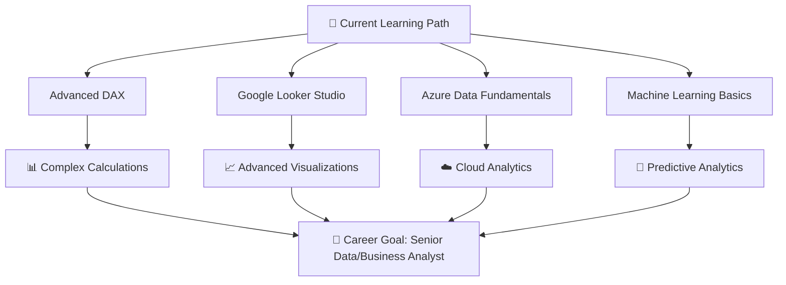

# Hi 👋, I'm D Praveen Kumar

<div align="center">
  
</div>

<div align="center">
  
  
  
</div>

## 🚀 About Me


🎯 **Data & Business Analyst** with hands-on experience in extracting actionable insights  
📊 Passionate about turning **raw data** into **compelling dashboards** and **data-driven solutions**  
📈 Specialized in **business problem-solving**, **forecasting**, **KPI analysis**, and **predictive insights**  
🌱 Currently learning: **Advanced DAX**, **Machine Learning**, **Google Looker Studio**, **Azure Data**  
💼 Open to opportunities in **Data Analysis**, **Business Intelligence** & **ML Analytics**  
🎓 Continuous learner with a passion for **data storytelling** and **intelligent analytics**

### 🔍 What I Do:
- **📊 Data Visualization:** Create interactive dashboards in Power BI & Tableau with smart insights
- **🗃️ Database Management:** Design and optimize SQL queries for business intelligence
- **🐍 Python Analytics:** Statistical analysis, data manipulation, and predictive modeling
- **📈 Business Intelligence:** KPI tracking, performance metrics, and forecasting
- **🎯 Advanced Analytics:** Trend analysis and machine learning for business insights

---

## 🛠️ Tech Stack & Tools

<div align="center">

### 📊 Data Analytics & Visualization
<p>
  
  
  
  
</p>

### 💻 Programming & Development
<p>
  
  
  
  
</p>

### 🤖 Machine Learning & Analytics
<p>
  
  
  
</p>

### 📚 Data Science Libraries
<p>
  
  
  
  
  
</p>

### 🗄️ Databases & Big Data
<p>
  
  
  
  
</p>

### ☁️ Cloud & Tools
<p>
  
  
  
  
</p>

</div>

---

## 📊 GitHub Analytics

<div align="center">
  
  
</div>

<div align="center">
  
</div>

<div align="center">
  
</div>

---

## 🏆 GitHub Achievements
<div align="center">
  
</div>

---

## 📊 Weekly Development Breakdown

<!--START_SECTION:waka-->
```text
Python       12 hrs 30 mins  ████████████▒░░░░░░░░░░░░   50.2%
SQL          6 hrs 45 mins   ██████▓░░░░░░░░░░░░░░░░░░   27.1%
Power BI     3 hrs 20 mins   ███▒░░░░░░░░░░░░░░░░░░░░░   13.4%
DAX          1 hr 30 mins    █▓░░░░░░░░░░░░░░░░░░░░░░░   6.0%
Others       50 mins         ▓░░░░░░░░░░░░░░░░░░░░░░░░   3.3%
```
<!--END_SECTION:waka-->

---

## 🎯 Current Focus

<div align="center">



</div>

---

## 📞 Let's Connect!

<div align="center">

### 🌐 Find me around the web:

<p>
<a href="https://www.linkedin.com/in/praveen-kumar-869844200" target="_blank">
  
</a>
<a href="mailto:praveenkumard083@gmail.com">
  
</a>
<a href="https://your-portfolio-link.com" target="_blank">
  
</a>
<a href="https://github.com/PRAVEEN5432114" target="_blank">
  
</a>
</p>

### 💼 Open for Opportunities:
- **Data Analyst** positions
- **Business Intelligence** roles
- **Analytics Engineering** opportunities
- **ML Analytics** roles
- **Freelance Projects** in data visualization & predictive analytics

</div>

---

<div align="center">
  
</div>

---

<div align="center">
  
</div>

<div align="center">
  
**"Turning data into insights, insights into decisions, and decisions into success with smart analytics!"** 📊🤖✨

### 📬 Feel free to reach out for collaborations or discussions about data-driven solutions!

</div>
