# Hi 👋, I'm D Praveen Kumar

<div align="center">
  
</div>

<div align="center">
  
  
  
</div>

## 🚀 About Me


🎯 **Data Analyst** with hands-on experience in extracting actionable insights  
📊 Passionate about turning **raw data** into **compelling dashboards**  
📈 Specialized in **business problem-solving**, **forecasting**, and **KPI analysis**  
🌱 Currently learning: **Advanced DAX**, **Google Looker Studio**, **Azure Data**  
💼 Open to opportunities in **Data Analysis** & **Business Intelligence**  
🎓 Continuous learner with a passion for **data storytelling**

### 🔍 What I Do:
- **📊 Data Visualization:** Create interactive dashboards in Power BI & Tableau
- **🗃️ Database Management:** Design and optimize SQL queries for insights
- **🐍 Python Analytics:** Statistical analysis and data manipulation
- **📈 Business Intelligence:** KPI tracking and performance metrics
- **🎯 Predictive Analytics:** Forecasting and trend analysis

---

## 🛠️ Tech Stack & Tools

<div align="center">

### 📊 Data Analytics & Visualization
<p>
  
  
  
  
</p>

### 💻 Programming & Development
<p>
  
  
  
  
</p>

### 📚 Libraries & Frameworks
<p>
  
  
  
  
  
</p>

### 🗄️ Databases
<p>
  
  
  
  
</p>

### ☁️ Cloud & Tools
<p>
  
  
  
  
</p>

</div>

---

## 📊 GitHub Analytics

<div align="center">
  
  
</div>

<div align="center">
  
</div>

<div align="center">
  
</div>

---

## 🏆 GitHub Achievements
<div align="center">
  
</div>

---

## 📈 Featured Projects

<div align="center">

### 🎯 Data Analytics Portfolio

<table>
<tr>
<td width="50%">

**📊 Sales Performance Dashboard**
- Interactive Power BI dashboard with real-time KPIs
- **Tech Stack:** Power BI, SQL, DAX
- **Features:** Sales trends, customer analysis, forecasting

[](https://github.com/PRAVEEN5432114/sales-dashboard)

</td>
<td width="50%">

**🔍 Customer Segmentation Analysis**
- Python-based customer behavior analysis
- **Tech Stack:** Python, Pandas, Seaborn, Scikit-learn
- **Features:** RFM analysis, clustering, insights

[](https://github.com/PRAVEEN5432114/customer-analytics)

</td>
</tr>
<tr>
<td width="50%">

**📈 Financial Forecasting Model**
- Time series analysis for revenue prediction
- **Tech Stack:** Python, SQL, Tableau
- **Features:** ARIMA modeling, trend analysis

[](https://github.com/PRAVEEN5432114/financial-forecasting)

</td>
<td width="50%">

**🏪 E-commerce Analytics Suite**
- Complete business intelligence solution
- **Tech Stack:** SQL, Power BI, Python
- **Features:** Sales funnel, cohort analysis, KPIs

[](https://github.com/PRAVEEN5432114/ecommerce-analytics)

</td>
</tr>
</table>

</div>

---

## 📊 Weekly Development Breakdown

<!--START_SECTION:waka-->
```text
Python       12 hrs 30 mins  ████████████▒░░░░░░░░░░░░   50.2%
SQL          6 hrs 45 mins   ██████▓░░░░░░░░░░░░░░░░░░   27.1%
Power BI     3 hrs 20 mins   ███▒░░░░░░░░░░░░░░░░░░░░░   13.4%
DAX          1 hr 30 mins    █▓░░░░░░░░░░░░░░░░░░░░░░░   6.0%
Others       50 mins         ▓░░░░░░░░░░░░░░░░░░░░░░░░   3.3%
```
<!--END_SECTION:waka-->

---

## 🎯 Current Focus

```mermaid
graph TD
    A[🎯 Current Learning Path] --> B[Advanced DAX]
    A --> C[Google Looker Studio]
    A --> D[Azure Data Fundamentals]
    A --> E[Machine Learning]
    
    B --> F[📊 Complex Calculations]
    C --> G[📈 Advanced Visualizations]
    D --> H[☁️ Cloud Analytics]
    E --> I[🤖 Predictive Models]
    
    F --> J[🚀 Career Goal: Senior Data Analyst]
    G --> J
    H --> J
    I --> J
```

<div align="center">



</div>

---

## 📞 Let's Connect!

<div align="center">

### 🌐 Find me around the web:

<p>
<a href="https://www.linkedin.com/in/praveen-kumar-869844200" target="_blank">
  
</a>
<a href="mailto:praveenkumard083@gmail.com">
  
</a>
<a href="https://your-portfolio-link.com" target="_blank">
  
</a>
<a href="https://github.com/PRAVEEN5432114" target="_blank">
  
</a>
</p>

### 💼 Open for Opportunities:
- **Data Analyst** positions
- **Business Intelligence** roles
- **Analytics Engineering** opportunities
- **Freelance Projects** in data visualization

</div>

---

<div align="center">
  
</div>

---

<div align="center">
  
</div>

<div align="center">
  
**"Turning data into insights, insights into decisions, and decisions into success!"** 📊✨

### 📬 Feel free to reach out for collaborations or just a friendly chat about data!

</div>
